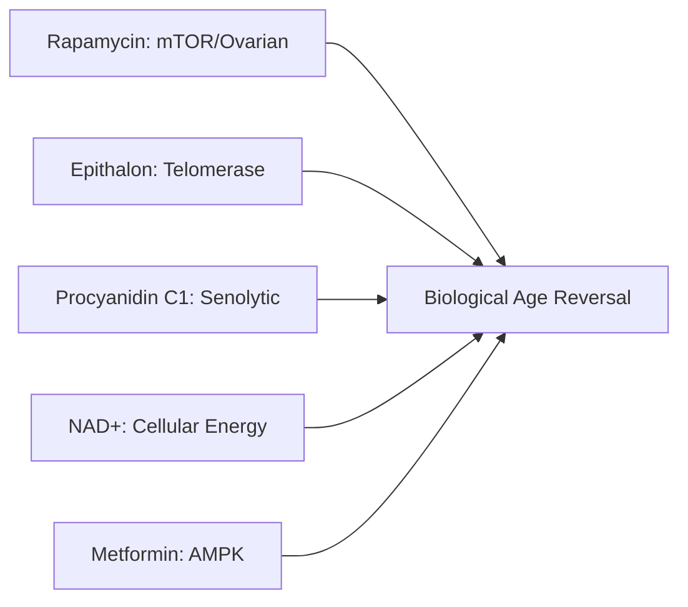

# ATHENA PROTOCOL

**Duration:** 16 Weeks

---

## GOALS

- Hormonal Balance
- Skin & Collagen
- Bone Density
- Cognitive & Mood
- Hair & Nails
- Stress & Adrenals
- Sleep & Recovery
- General Longevity

---

## PEPTIDES (11) + NAD+

| Peptide | Dose | Frequency | Intended Benefit |
|---------|------|-----------|------------------|
| **GHK-Cu** | 2mg SC | Daily | Collagen induction, skin elasticity, hair growth |
| **PT-141** | 1.75mg SC | As needed (max 2x/week) | Libido, sexual function (FDA-approved for women) |
| **Kisspeptin-10** | 1-4mcg/kg SC | Pulsed (cycle support) | GnRH regulation, hormonal balance |
| **Selank** | 400mcg intranasal | 2-3x daily | Anxiolytic without sedation, stress resilience |
| **Semax** | 400mcg intranasal | Morning | Cognitive clarity, BDNF, mood elevation |
| **DSIP** | 200mcg SC | Daily before bed | Sleep architecture, recovery optimization |
| **BPC-157** | 250mcg SC | 2x daily | Gut-hormone axis, tissue repair |
| **Tesamorelin** | 2mg SC | Daily | GH release, skin quality, body composition |
| **SS-31** | 5mg SC | 3x/week | Mitochondrial repair (cardiolipin) |
| **MOTS-c** | 10mg SC | 3x/week | Mitochondrial biogenesis |
| **Epithalon** | 5-10mg SC | Daily x 10-20 days (2-3x/year) | Telomerase activation, longevity |
| **NAD+** | 100-250mg SC/IM | 2-3x/week | Ovarian NAD+ restoration, cellular energy, longevity |

---

## SUPPLEMENTS (14)

| Supplement | Dose | Frequency | Intended Benefit |
|------------|------|-----------|------------------|
| **Vitamin D3** | 5,000 IU | Morning with fat | Bone density, immunity, mood |
| **Vitamin K2 (MK-7)** | 200mcg | Morning with D3 | Calcium direction to bones, CV protection |
| **Omega-3** | 2,000mg | With meals | Brain, CV, anti-inflammatory |
| **Magnesium Glycinate** | 400mg | Before bed | Sleep, mood, bone, muscle |
| **Collagen Peptides** | 10-15g | Morning | Skin, hair, nails, joints |
| **CoQ10 (Ubiquinol)** | 200mg | Morning with fat | Mitochondrial stack, heart |
| **Ca-AKG** | 1,000mg | 2x daily | Longevity, TCA cycle |
| **TMG** | 1,000mg | Morning | Methyl donor (critical with Metformin) |
| **Glycine** | 3g | Before bed | Glutathione, collagen, sleep |
| **NAC** | 600mg | Morning | Glutathione precursor, antioxidant |
| **Biotin** | 5,000mcg | Morning | Hair, nails |
| **Myo-Inositol** | 2-4g | Daily | Insulin sensitivity, egg quality, PCOS, mood |
| **DIM** | 100-200mg | Daily | Estrogen metabolism (critical with HRT) |
| **Creatine** | 3g | Daily | Cognitive function, bone density |

---

## PHARMACEUTICALS (8)

| Drug | Dose | Frequency | Intended Benefit |
|------|------|-----------|------------------|
| **Estradiol** (bioidentical) | Per protocol | Per protocol | HRT foundation, bone, CV, cognition |
| **Progesterone** (bioidentical) | Per protocol | Cycling or continuous | HRT, sleep, mood, uterine protection |
| **Testosterone** (low-dose) | 1-5mg cream/day or 10-25mg injection/week | Per protocol | Libido, energy, muscle tone, confidence |
| **Cabergoline** (Dostinex) | 0.25-0.5mg | 1-2x/week | Prolactin control, libido, dopaminergic mood |
| **Metformin** | 500-1000mg | 1-2x daily | AMPK activation, longevity, insulin sensitivity |
| **Rapamycin** | 2mg (increase to 5mg over time) | Weekly | Ovarian aging (20% slower), mTOR inhibition, longevity |
| **Procyanidin C1** | 115mg | 3 days/month | Senolytic, senescent cell clearance |
| **Tirzepatide** | Low/micro dose | Per protocol | GLP-1/GIP, body composition, appetite |

*Optional:*
- **DHEA**: 10-25mg daily if levels low

---

## SYNERGY STACKS

### Hormonal Balance

### Skin & Appearance

### Cognitive & Mood

### Mitochondrial (Holy Grail)

### Sleep & Recovery

### Longevity

### Protective

### Women's Metabolic

---

## RATIONALE

The Athena Protocol addresses the unique physiological needs of women through mechanistically synergistic interventions. The hormonal foundation combines bioidentical Estradiol, Progesterone, and low-dose Testosterone with Cabergoline for prolactin optimization and Kisspeptin for GnRH axis support. Rapamycin (2-5mg weekly) directly targets ovarian aging — the VIBRANT trial showed 20% slower ovarian aging with potential for 5 extra fertile years. DIM supports healthy estrogen metabolism, critical when on HRT.

The appearance stack leverages GHK-Cu (28% collagen increase in RCT data) with oral collagen peptides and Tesamorelin-driven GH release. BPC-157 supports the gut-hormone axis — gut health drives hormone metabolism. The cognitive-mood axis pairs Semax (BDNF, dopaminergic activation) with Selank (anxiolytic without sedation or dependence), while Creatine provides overlooked cognitive and bone density benefits for women. Tirzepatide adds orthogonal GLP-1/GIP control for body composition.

The "Holy Grail" mitochondrial stack (SS-31 + MOTS-c + NAD+ + CoQ10) addresses cellular energy at four levels: repair existing mitochondria, build new ones, restore the critical NAD+ substrate that declines sharply at menopause, and fuel the electron transport chain. Myo-Inositol provides insulin sensitivity and egg quality support with strong evidence for women. Longevity vectors include Rapamycin (mTOR), Epithalon (telomerase), Procyanidin C1 (senolytic), NAD+ (cellular energy), and Metformin (AMPK) — attacking aging through five non-redundant pathways.

---

## NOTES

### Pre-Menopausal Considerations
- Kisspeptin and HRT doses adjusted per cycle phase
- PT-141 can be used for libido regardless of hormonal status
- Cabergoline particularly useful if elevated prolactin or post-pill amenorrhea

### Bone Density Support
- Estradiol is foundation for bone protection
- Vitamin D3 + K2 combination directs calcium appropriately
- Weight-bearing exercise synergizes with protocol

### Hair & Nails
- GHK-Cu: Proven hair growth effects via Wnt signaling
- Biotin: Keratin support
- Collagen peptides: Structural support

### Cycle Timing (for pulsed compounds)
- Epithalon: 10-20 days, 2-3x/year
- Procyanidin C1: 3 consecutive days/month
- Rapamycin: Start 2mg weekly, increase to 5mg over time

---

*Experimental protocol. Monitoring recommended. Hormone levels should be tracked by qualified practitioner.*
