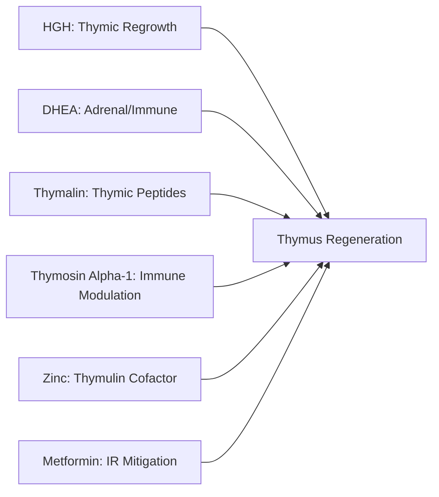
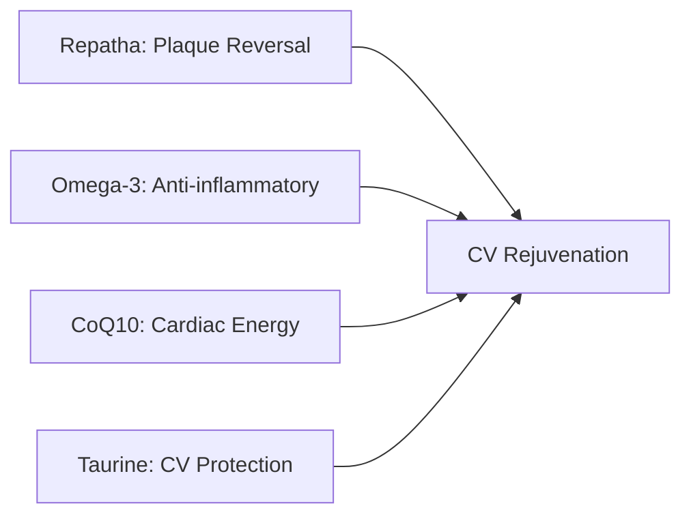
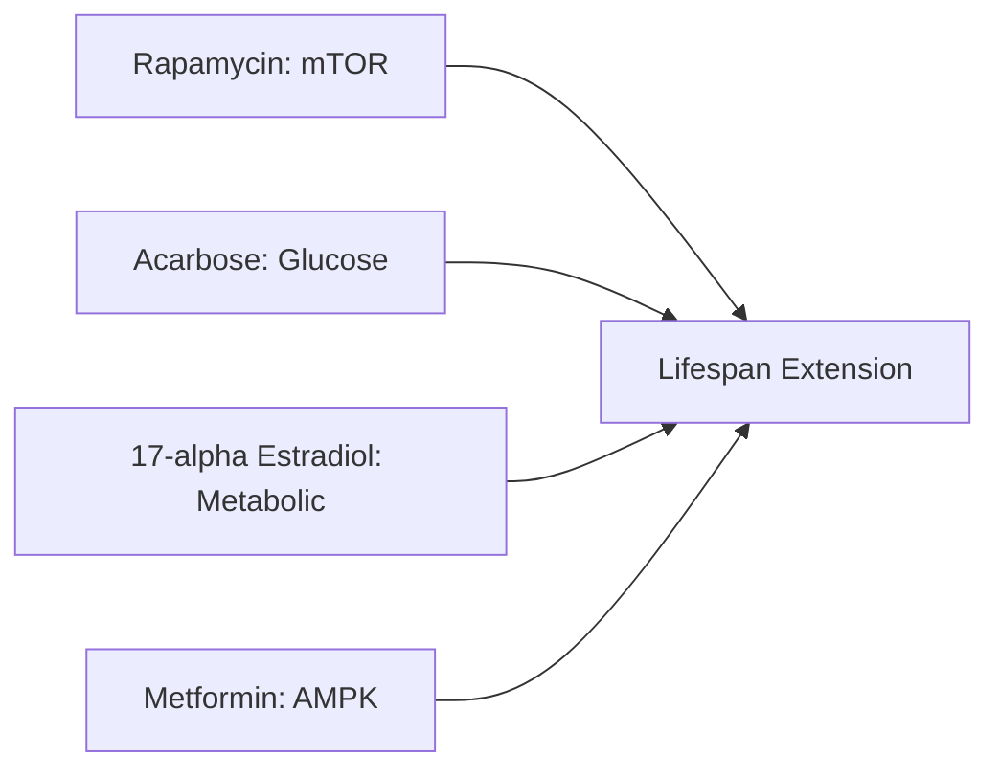
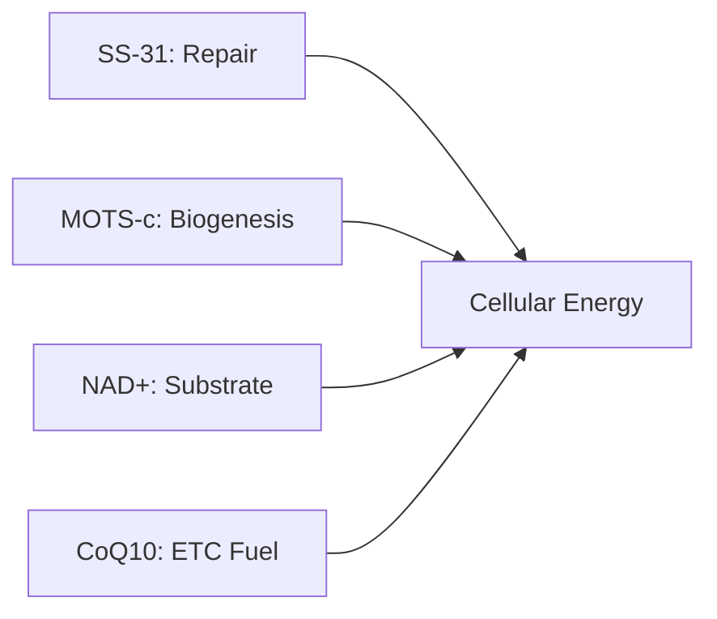
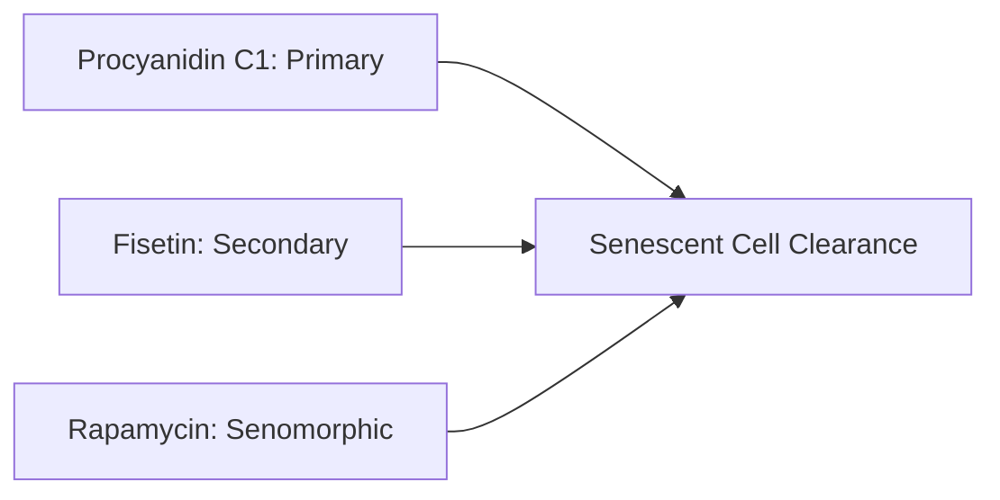
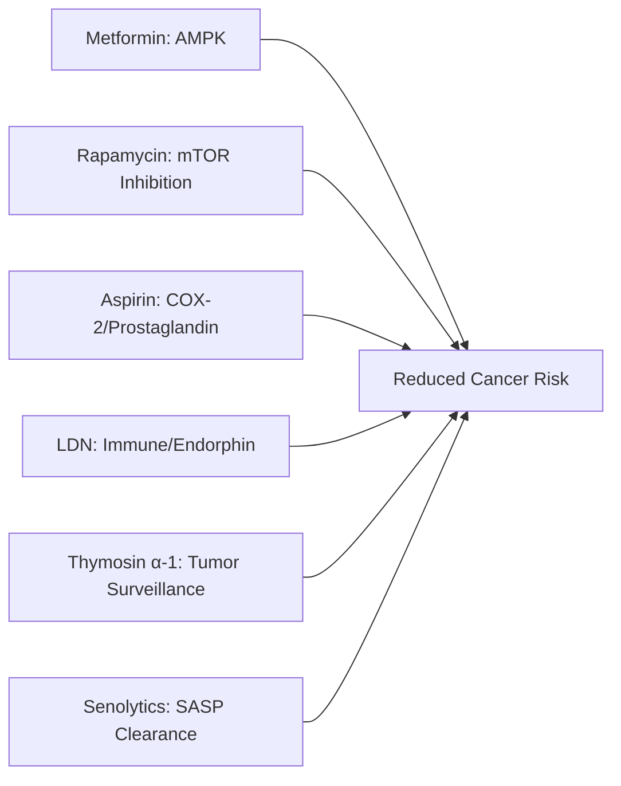
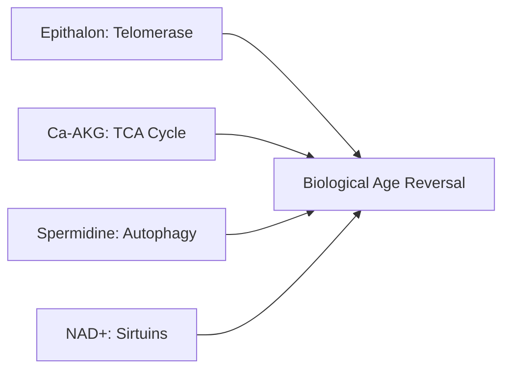
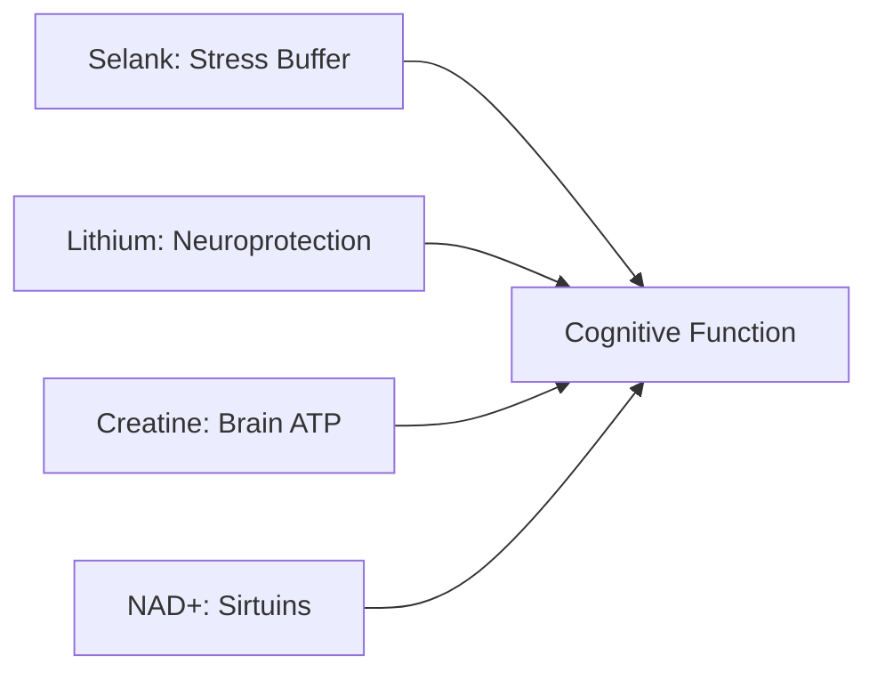

# PROMETHEUS PROTOCOL

**Duration:** 12-16 Weeks (cyclical)
**Target:** Men and Women
**Philosophy:** Aggressive biological age reversal through multi-pathway intervention

**Related:** [Safety Considerations](prometheus-safety.md) | [Monitoring & Bloodwork](prometheus-monitoring.md)

---

Prometheus was the Titan who stole fire from the gods and gave it to humanity — punished eternally for daring to breach the boundary between mortal limitation and divine capability. The Prometheus Protocol embodies that same defiance: an aggressive, evidence-based assault on biological aging that pushes beyond conservative margins. Built on the TRIIM trial's demonstrated 2.5-year epigenetic age reversal, the NIA Interventions Testing Program's gold-standard lifespan compounds, and PCSK9 inhibition for cardiovascular rejuvenation, this protocol is for those who accept comprehensive monitoring in exchange for magnitude of effect. Peptide selection explicitly minimises oncogenic risk while an oncoprotective pharmaceutical stack (Metformin, Rapamycin, Low-Dose Aspirin, LDN) counterbalances the theoretical concerns of GH-pathway interventions. This is not optimisation — it is reversal.

---

## GOALS

- Biological Age Reversal
- Thymus Regeneration / Immune Restoration
- Cardiovascular Rejuvenation (Plaque Reversal)
- Metabolic Optimization
- Telomere Maintenance
- Cellular Senescence Clearance
- Mitochondrial Restoration
- Cognitive Preservation

---

## PHARMACEUTICALS (12) — TRIIM-X Inspired + ITP-Validated + Oncoprotective

| Drug | Dose | Frequency | Intended Benefit |
|------|------|-----------|------------------|
| **HGH (rhGH)** | 1-2 IU (titrate to 3 IU) | 3-4x/week | Thymus regeneration, body composition (TRIIM core) |
| **DHEA** | 25-50mg (F/M) | Daily | Adrenal precursor, immune (TRIIM core) |
| **Metformin** | 500-1000mg | 1-2x daily | AMPK, insulin mitigation (TRIIM core) |
| **Rapamycin** | 3-6mg | Weekly | mTOR inhibition, longevity (ITP gold standard) |
| **Acarbose** | 50-100mg | With meals | Alpha-glucosidase inhibitor (stronger in males) |
| **17-alpha Estradiol** | 50-100mcg *(males)* | Daily | Non-feminizing, 19% male lifespan (ITP) |
| **Repatha (Evolocumab)** | 140mg SC | Every 2 weeks | PCSK9i: plaque reversal, LDL, CV aging |
| **Testosterone** | Per protocol (both sexes) | Per protocol | Androgen optimization (low-dose for women) |
| **Tirzepatide** | Low/micro dose | Per protocol | GLP-1/GIP, visceral fat, metabolic |
| **Procyanidin C1** | 115mg | 3 days/month | Senolytic, senescent cell clearance |
| **Low-Dose Aspirin** | 75-100mg | Daily | COX-2 inhibition, 13% CRC reduction, anti-inflammatory |
| **Low-Dose Naltrexone (LDN)** | 1.5-4.5mg | Nightly | Immune modulation, endorphin upregulation, anti-proliferative |

*Supportive (TRIIM protocol):*
- **Vitamin D3**: 3,000-5,000 IU daily
- **Zinc**: 50mg daily (thymulin cofactor)

*Sex-specific notes:*
- **17-alpha Estradiol**: Males only (no female lifespan benefit in ITP)
- **Acarbose**: Stronger effect in males (22%) vs females (5%)
- **DHEA**: Lower dose for women (25mg) vs men (50mg)
- **Testosterone**: Standard TRT for men; low-dose (1-5mg cream) for women

---

## PEPTIDES (9) — Oncogenic-Risk Minimized

*Strategy: Maximize longevity/immune peptides, minimize angiogenic/proliferative ones*

| Peptide | Dose | Frequency | Intended Benefit | Oncogenic Risk |
|---------|------|-----------|------------------|----------------|
| **Epithalon** | 10mg SC | Daily x 20 days (2-3x/year) | Telomerase activation, may be protective | LOW (protective) |
| **Thymalin** | 10-20mg SC | Daily x 10-14 days (2x/year) | Thymus restoration, immune (synergy with HGH) | LOW |
| **Thymosin Alpha-1** | 1.6mg SC | 2x/week | Immune modulation, 9% mortality reduction (sepsis data), 35+ country approvals | LOW |
| **SS-31 (Elamipretide)** | 5mg SC | 3x/week | Mitochondrial repair (cardiolipin) | LOW |
| **MOTS-c** | 10mg SC | 3x/week | Mitochondrial biogenesis, metabolic | LOW |
| **NAD+** | 100-250mg SC/IM | 2-3x/week | Cellular energy, sirtuin activation | LOW |
| **KPV** | 200-400mcg SC | Daily | Anti-inflammatory (alpha-MSH fragment), gut | LOW |
| **Selank** | 400mcg intranasal | 2-3x daily | Anxiolytic, stress resilience | LOW |
| **Tesamorelin** | 2mg SC | Daily | FDA-approved GH releaser, VAT reduction | MODERATE (GH pathway) |

*EXCLUDED (oncogenic concerns):*
- BPC-157: Angiogenic, proliferative
- TB-500: Angiogenic
- Follistatin: Myostatin inhibition, theoretical proliferative risk
- GHK-Cu: Mixed evidence (use topically only if desired)
- CJC-1295/Ipamorelin: Less controlled GH release than Tesamorelin

---

## SUPPLEMENTS (16)

| Supplement | Dose | Frequency | Intended Benefit |
|------------|------|-----------|------------------|
| **Ca-AKG** | 1,000mg | 2x daily | TCA cycle, biological age (8-year reversal in trial) |
| **Creatine** | 5g | Daily | ATP, cognitive, muscle |
| **Glycine** | 3-5g | Before bed | Glutathione, collagen, sleep |
| **Taurine** | 1-2g | Daily | CV, longevity (ITP interest) |
| **L-Theanine** | 200mg | Morning | Calm focus, synergy with Selank |
| **Fisetin** | 500mg | 2 days/month | Senolytic (complements Procyanidin C1) |
| **Ubiquinol (CoQ10)** | 200mg | Morning | Mitochondrial, ETC fuel |
| **TMG** | 1,000mg | Morning | Methylation (critical with Metformin) |
| **NAC** | 600mg | Morning | Glutathione precursor |
| **Omega-3** | 2-3g | With meals | CV, brain, anti-inflammatory |
| **Vitamin D3** | 5,000 IU | Morning | Immune, bone, TRIIM component |
| **Vitamin K2 (MK-7)** | 200mcg | Morning | Calcium direction, CV |
| **Zinc** | 50mg | Daily | Thymulin cofactor (TRIIM), immune |
| **Magnesium Glycinate** | 400mg | Before bed | Sleep, CV, muscle |
| **Lithium Orotate** | 5mg | Daily | Neuroprotection, mood stability |
| **Spermidine** | 10mg | Daily | Autophagy induction |

---

## SYNERGY STACKS

### Thymus Regeneration (TRIIM Core + Enhanced)

### Cardiovascular Reversal

### Lifespan Extension (ITP-Validated)

### Mitochondrial (Holy Grail)

### Senolytic (Zombie Cell Clearance)

### Oncoprotective (Cancer Risk Reduction)

### Telomere / Longevity

### Cognitive Preservation

---

## RATIONALE

The Prometheus Protocol represents the most aggressive evidence-based approach to biological age reversal, built on three pillars: the TRIIM trial's demonstrated 2.5-year epigenetic age reversal through HGH + DHEA + Metformin thymus regeneration; the NIA Interventions Testing Program's gold-standard lifespan compounds (Rapamycin, Acarbose, 17-alpha Estradiol); and PCSK9 inhibition for cardiovascular aging reversal.

The pharmaceutical stack targets aging through nine distinct mechanisms: mTOR inhibition (Rapamycin), AMPK activation (Metformin), alpha-glucosidase inhibition (Acarbose), thymic regeneration (HGH + Thymalin), metabolic optimization (17-alpha Estradiol, Tirzepatide), cardiovascular reversal (PCSK9i), senescent cell clearance (Procyanidin C1), and oncoprotective intervention (Low-Dose Aspirin + LDN). Unlike typical protocols, this includes ITP-validated 17-alpha Estradiol — a "non-feminizing" estrogen that extends male lifespan by 19% through metabolic pathways requiring intact testosterone. The oncoprotective layer adds Low-Dose Aspirin (13% CRC reduction in 2.1M patient study) and Low-Dose Naltrexone (immune modulation, NK cell enhancement, TLR4 antagonism) to counterbalance the theoretical oncogenic concerns of GH-pathway interventions.

Peptide selection explicitly minimizes oncogenic risk. BPC-157, TB-500, and Follistatin are excluded due to angiogenic and proliferative concerns. The remaining peptides target safe pathways: Epithalon (telomerase — may be protective), Thymalin (immune), Thymosin Alpha-1 (immune modulation with 9% mortality reduction in sepsis meta-analysis, 35+ country approvals, FDA orphan drug — enhances tumor surveillance without stimulating growth), SS-31 and MOTS-c (mitochondrial), NAD+ (sirtuins), KPV (anti-inflammatory without angiogenic risk), and Selank (stress resilience). Tesamorelin is retained as the only GH-pathway peptide due to its FDA approval and targeted VAT reduction.

The supplement stack combines evidence-based longevity compounds (Ca-AKG, Creatine, Glycine, Taurine, Lithium) with autophagy inducers (Spermidine, Fisetin) and protective methylation support (TMG — critical given Metformin's B12/folate depletion). This is designed for individuals with comprehensive monitoring who prioritise magnitude of effect over conservative safety margins.

---

*Aggressive experimental protocol for men and women. Requires comprehensive monitoring and qualified medical supervision. Not suitable for those with cancer history or high cancer risk.*
