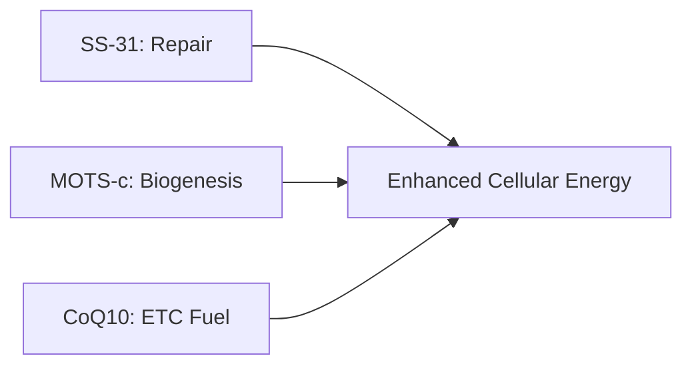
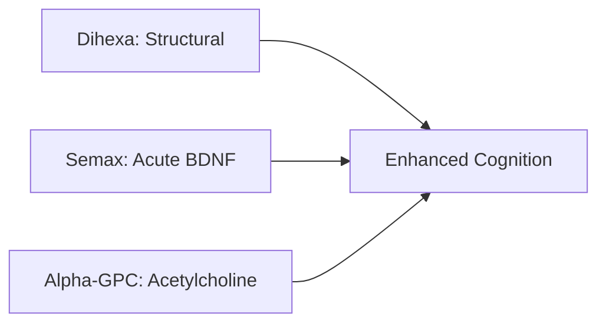
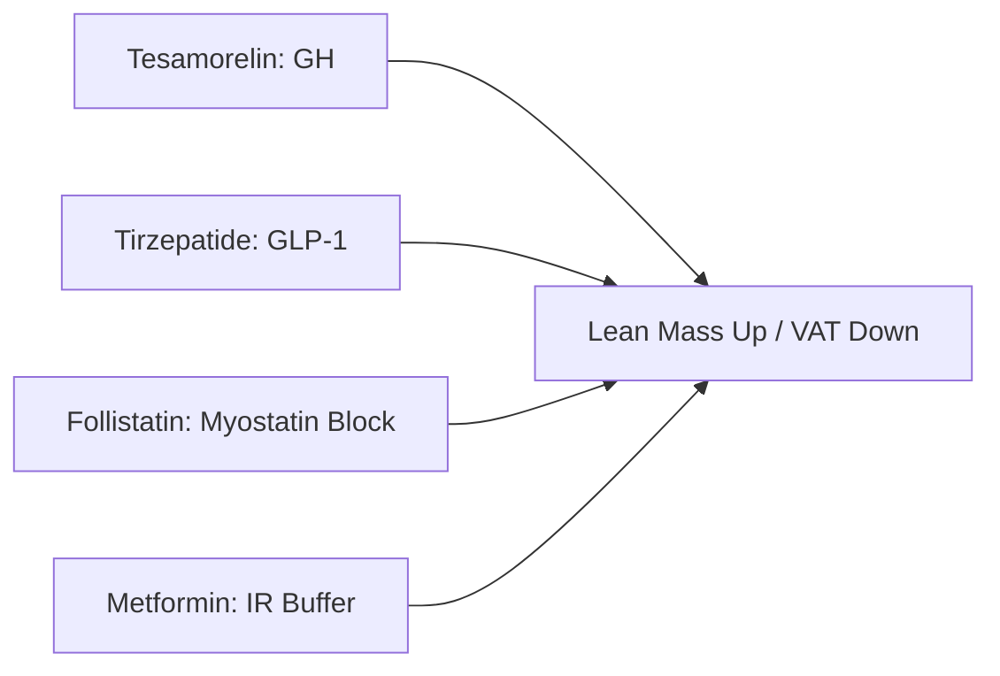
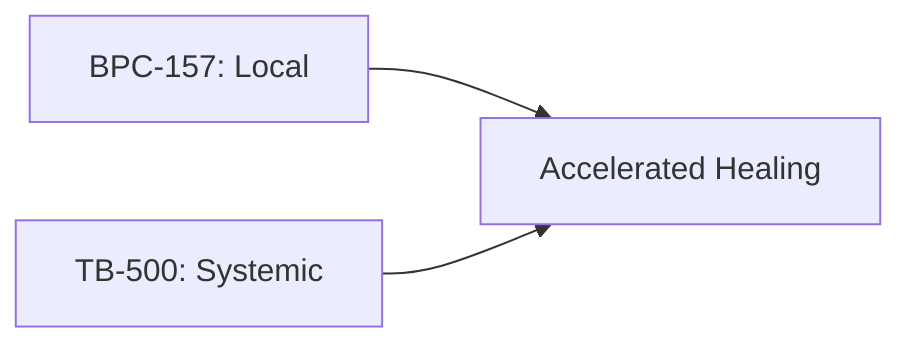
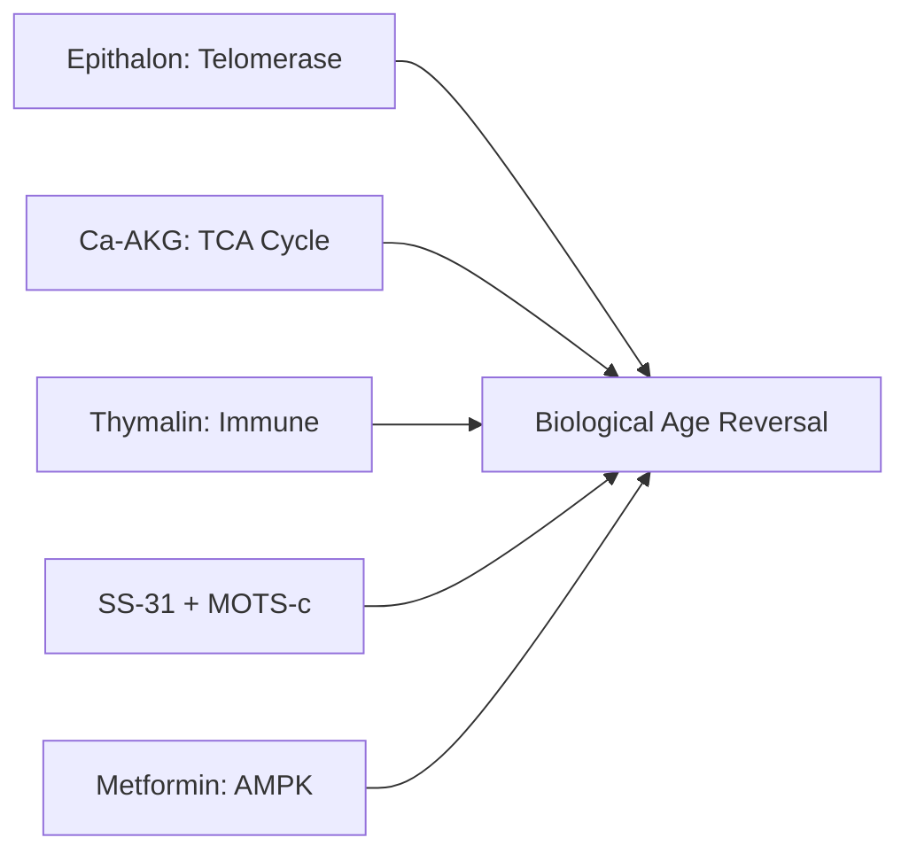
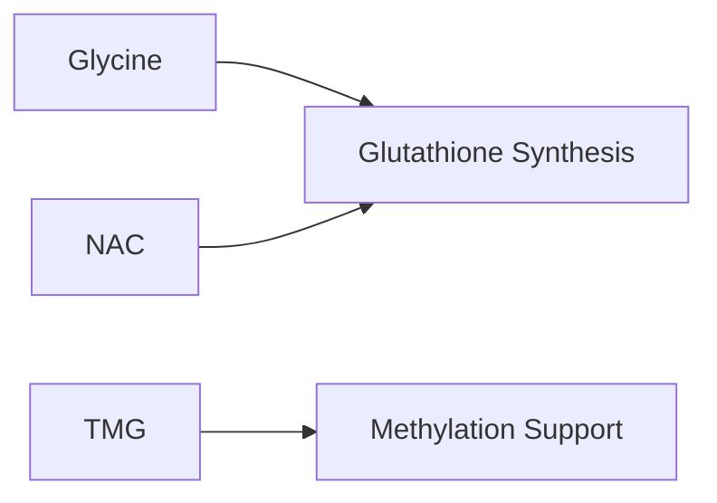

# TITAN PROTOCOL

**Duration:** 16 Weeks
**Target:** Men
**Philosophy:** Reclaim masculine vitality through synergistic performance enhancement and longevity integration

**Related:** [Safety Considerations](titan-safety.md) | [Monitoring & Bloodwork](titan-monitoring.md)

---

In Greek mythology, the Titans were primordial beings of immense strength and power — the original forces that shaped the world before the Olympians. The Titan Protocol is designed for men seeking to build that foundation: raw physical capability, cognitive sharpness, and the metabolic efficiency of youth. This is not about fighting aging defensively — it's about actively reclaiming the performance characteristics that define masculine vitality. The protocol prioritises muscle, mind, and metabolism through synergistic peptide stacks, with longevity as an integrated outcome rather than an afterthought.

---

## GOALS

- Testosterone Support
- Lean Muscle
- Cognitive Enhancement
- Cardiovascular Health
- Recovery/Sleep
- Visceral Fat Reduction
- Longevity
- Skin/Appearance

---

## PEPTIDES (12)

| Peptide | Dose | Frequency | Intended Benefit |
|---------|------|-----------|------------------|
| **Tesamorelin** | 2mg SC | Daily | GH, VAT reduction |
| **Follistatin-344** | 100mcg SC | Daily x 10-14 days (2 courses) | Myostatin blockade |
| **Dihexa** | 10-20mg oral | Daily (4-6 weeks on, 2-4 off) | Structural cognitive enhancement (HGF/c-Met) |
| **Semax 0.1%** | 400mcg intranasal | Daily | Acute nootropic, BDNF, dopaminergic |
| **SS-31** | 5mg SC | 3x/week | Mitochondrial repair (cardiolipin) |
| **MOTS-c** | 10mg SC | 3x/week | Mitochondrial biogenesis (makes more) |
| **BPC-157** | 250-500mcg SC | 2x daily | Local tissue repair, GI protection |
| **TB-500** | 2.5mg SC | 2x/week loading, 1x/week maintenance | Systemic stem cell mobilization |
| **DSIP** | 200mcg SC | Daily before bed | Sleep architecture, GH pulse optimization |
| **GHK-Cu** | 1-2mg SC | Daily | Skin elasticity, collagen induction, external youth |
| **Epithalon** | 5-10mg SC | Daily x 10-20 days (2-3x/year) | Telomerase, longevity |
| **Thymalin** | 10-20mg SC | Daily x 10-14 days (2-3x/year) | Immune restoration |

---

## SUPPLEMENTS (11)

| Supplement | Dose | Frequency | Intended Benefit |
|------------|------|-----------|------------------|
| **Vitamin D3** | 5,000 IU | Morning with fat | Immunity, muscle, bone |
| **Creatine** | 5g | Post-workout | ATP, strength, muscle |
| **Omega-3** | 2,000mg | With meals | Brain, CV, anti-inflammatory |
| **Magnesium Glycinate** | 400mg | Before bed | Sleep, muscle, BP |
| **CoQ10 (Ubiquinol)** | 200mg | Morning with fat | ETC support, mitochondrial stack |
| **Alpha-GPC** | 600mg | Morning | Cognitive synergy with Dihexa |
| **Zinc** | 30mg | Before bed | Immunity, enzymes |
| **Ca-AKG** | 1,000mg | 2x daily | Longevity, TCA cycle |
| **TMG** | 1,000mg | Morning | Methyl donor (critical with Metformin) |
| **Glycine** | 3g | Before bed | Glutathione, collagen, sleep |
| **NAC** | 600mg | Morning | Glutathione precursor, antioxidant |

---

## PHARMACEUTICALS (3)

| Drug | Dose | Frequency | Intended Benefit |
|------|------|-----------|------------------|
| **Testosterone Cypionate** | Per protocol | Per protocol | Exogenous testosterone |
| **Metformin** | 500-1000mg | 1-2x daily | AMPK, GH-induced IR mitigation |
| **Tirzepatide** | Low/micro dose | Per protocol | GLP-1/GIP, appetite, insulin |

*Optional addons:*
- **Procyanidin C1**: 115mg, 3 days/month (senolytic)

---

## SYNERGY STACKS

### Mitochondrial (Holy Grail)

### Cognitive

### Body Composition

### Recovery

### Longevity

### Protective

### Appearance

---

## RATIONALE

The Titan Protocol targets seven physiological domains through mechanistically non-redundant synergies. Testosterone Cypionate provides the androgen foundation while Tesamorelin (FDA-approved) drives visceral fat reduction via GH — with Metformin pre-emptively buffering GH-induced insulin resistance. Tirzepatide adds orthogonal GLP-1/GIP appetite and insulin control. Follistatin-344 removes the genetic ceiling on muscle growth by blocking myostatin.

The cognitive stack layers Dihexa's structural brain remodeling (10 million x BDNF potency, persistent dendritic changes) with Semax's acute BDNF/dopaminergic effects — architectural change plus daily sharpness. The mitochondrial "Holy Grail" combines SS-31 (repairs existing mitochondria), MOTS-c (creates new ones), and CoQ10 (fuels the ETC) — repair, build, optimize. BPC-157 and TB-500 deliver dual-layer recovery: local tissue repair plus systemic stem cell mobilization.

Longevity compounds attack aging through multiple vectors: Epithalon (telomerase), Thymalin (immune restoration), Ca-AKG (biological age), while GHK-Cu ensures external appearance matches internal reversal. TMG protects methylation from Metformin depletion; Glycine + NAC drive glutathione synthesis. Every compound was stress-tested for redundancy — what remains is integration, not accumulation.

---

*Experimental protocol. Monitoring recommended.*
